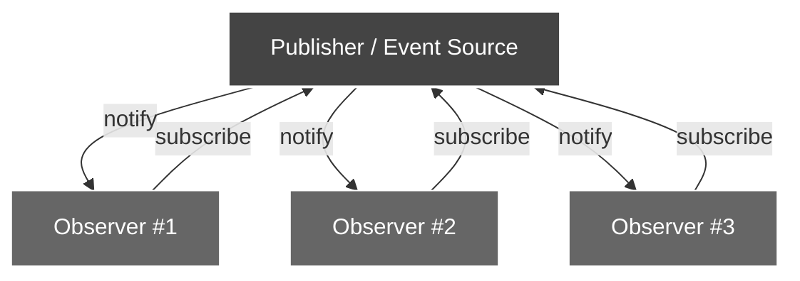

# 🧩 Observer Library (MISRA-C / Safety-Oriented Ready)

A **deterministic**, **zero-dynamic-memory**, and **MISRA-C:2012 compliant** implementation of the **Observer Pattern** in pure C — designed for **embedded**, **real-time**, and **safety-oriented applications**.

> ⚠️ Note: This library is **not certified** for ISO 26262, DO-178C, or any other formal safety standard. It provides a **deterministic, statically-allocated foundation** and demonstrates **best practices for safety-oriented software design**. Formal certification requires additional **safety analysis, risk assessment, and documentation**.

---


## 🌐 Online Documentation

Looking for a better browsing experience?  

<p align="center">
  <b>📘 Explore the full documentation at:</b><br>
  <a href="https://niwciu.github.io/OBSERVER">
    🌐 https://niwciu.github.io/OBSERVER
  </a><br>
  <i>Includes Doxygen docs, examples, coverage and analysis reports.</i>
</p> 

Additional reports and analysis:
- 📊 [GCOVR Report (Code Coverage)](https://niwciu.github.io/OBSERVER/reports/gcovr.html)  
- 📈 [Code Complexity Report](https://niwciu.github.io/OBSERVER/reports/code_complexity_report.html)

> 💡 **Recommended:** The web version provides full navigation, diagrams, and integration examples with better readability.

---

## 🚀 Key Features

This library provides a deterministic, static-memory foundation for the Observer pattern, suitable for safety-oriented embedded systems. Its key characteristics include:

* ✅ **MISRA-C:2012 compliant** – verified via *Cppcheck* and *PC-lint*  
* ✅ **Zero dynamic memory allocation** – all subscription tables are statically allocated  
* ✅ **Deterministic execution** – all operations bounded by compile-time table sizes  
* ✅ **Externally synchronized thread-safety** – safe if caller manages access via mutex or critical section  
* ✅ **Designed for safety-oriented projects** – demonstrates best practices in modularity, static memory, and defensive programming  
* ✅ **Defensive argument validation** – all public API functions validate input parameters  
* ✅ **Full unit test coverage** – 100% statement coverage verified with Unity and gcovr  
* ✅ **Support for static analysis and complexity checks** – integrates with Cppcheck, Lizard, clang-format, and Doxygen for maintainability  

> ⚠️ Note: While this library demonstrates safety-oriented design practices, it **is not formally certified**. Formal certification requires additional safety analysis, documentation, and risk assessment.

---


## 🧠 Observer Design Pattern – Concept Overview

The **Observer Pattern** defines a one-to-many dependency between objects so that when one object (the *Publisher*) changes state, all its dependent objects (the *Observers*) are notified automatically.

In embedded and safety-oriented systems, this pattern enables **deterministic event propagation** without dynamic allocation or runtime discovery.

### 🧩 Conceptual Flow


> 💡 **How it works:** Observers register their callbacks in a static subscription table owned by the Publisher.  
> When an event occurs, the Publisher calls `notify()` deterministically.  
> No dynamic memory or recursion is used — all behavior is bounded at compile time.


---

## 🧩 Integration & Observer Library Examples

The library provides **ready-to-run integration examples** in the [`examples`](examples/) directory.  
These demonstrate:

* How to integrate the **Observer library** into an application.  
* Realistic usage patterns with **mocked embedded hardware modules** (e.g., pushbuttons, LEDs, sensors).  
* Deterministic behavior using **statically allocated observer tables** and **MISRA-C:2012 compliant** design.

> 💡 Each example includes **block diagrams** and **commented code** explaining module interactions, subscription flow, and event notifications.

### 📘 Available Examples

| Example | Description | Folder |
|:--|:--|:--|
| **Basic Observer** | Simple callback example using pushbutton, LED and LCD mocks | [🔗 Open basic_observer](https://github.com/niwciu/OBSERVER/tree/main/examples/basic_observer) |
| **State Observer** | Observer with `event_state_e` argument demonstrating ENTER/EXIT states | [🔗 Open state_observer](https://github.com/niwciu/OBSERVER/tree/main/examples/state_observer) |
| **Sensor Observer** | Observer with `uint8_t` argument demonstrating periodic sensor updates | [🔗 Open observer_u8](https://github.com/niwciu/OBSERVER/tree/main/examples/observer_u8) |

> 💡 Each example includes **block diagrams** and **commented code** explaining module interactions, subscription flow, and event notifications.  
> ⚠️ All examples demonstrate **deterministic behavior** using statically allocated tables and are **not certified for safety-critical use**.  
> ℹ️ See [`examples/README.md`](examples/README.md) for detailed explanations and flow diagrams.


---

## 📁 Directory Layout

```
/observer_lib/
├── .github/   
│   └── workflows/                      # Github Actions workflows                            
├── docs/                               # Files required for deploy library webpage & publish documentation
├── examples/
│   ├── basic_observer/                 # Basic no-arg callback
│   ├── state_observer/                 # Uses event_state_e argument callback
│   ├── observer_u8/                    # Uses uint8_t argument callback
│   └── README.md                       # Examples description file
│
├── hw/                                 # Specific hardware configurations
├── lib/
│   └── observer/
│       ├── observer.c                  # Core implementation
│       ├── observer.h                  # Public API
│       └── observer_public_types.h     # Enums & callback typedefs
├── test/
│   ├── config_scripts/
│   │   ├── run_targets               
│   │   │   └── CI.py                   # CI python script to run on local machine
│   │   │   └── config.yaml             # CI config file for setup and customize CI workflow    
│   │   └── venv_setup                   
│   │       └── requirements.txt        # Python tools required by scripts in project
│   │       └── venv_setup.py           # Python script for setting up venv and install dependencies        
│   ├── observer/                       # Unit tests (Unity)
│   ├── template/                       # Module unit tests template
│   └── unity/                          # Test framework
├── .clang-format                       # clang-format rules
├── LICENSE                             
├── mkdocs.yml                          # MkDocs deploy settings
└── README.md
```

>⚠️ Note: All examples are deterministic, statically allocated, and intended for demonstration purposes; they are not certified for safety-critical use.

---

### 🔧 Core Concepts

| Role       | Responsibility |
| ----------- | -------------- |
| **Publisher** | Maintains a static table of observer callbacks and notifies them upon events. |
| **Observer**  | Registers a callback function to receive event notifications. |
| **Event**     | A deterministic trigger (button press, state change, sensor update). |

### ⚙️ Why This Implementation Is Different

Unlike typical dynamic implementations, this library is:

- **Zero-dynamic-memory** — all subscription tables are statically allocated.  
- **MISRA-C:2012 compliant** — validated through Cppcheck and PC-lint.  
- **Deterministic** — every operation bounded at compile time.  
- **Safety-oriented** — promotes traceability and modular isolation of side effects.  

> 💡 This implementation bridges the conceptual simplicity of the Observer Pattern with the rigorous requirements of **safety-critical embedded software**.

For detailed integration examples, see [🧩 Observer Library Examples](examples/README.md).

---

## ⚙️ Public API Reference

### 1️⃣ Callbacks Without Arguments

#### `subscribe()`

```c
subscr_status_e subscribe(observer_cb_t *subscription_table,
                          observer_cb_t cb_2_register,
                          uint8_t subscription_table_size);
```

Registers a callback function.
Returns one of:

* `OBSERVER_OK` — callback registered or already present
* `OBSERVER_INVALID_ARGUMENT_ERROR` — invalid pointer or zero size
* `OBSERVER_TABLE_FULL_ERROR` — no free slot available

---

#### `unsubscribe()`

```c
subscr_status_e unsubscribe(observer_cb_t *subscription_table,
                            observer_cb_t cb_2_register,
                            uint8_t subscription_table_size);
```

Removes a callback and compacts the table.
Returns:

* `OBSERVER_OK`
* `OBSERVER_TABLE_EMPTY_ERROR`
* `OBSERVER_INVALID_ARGUMENT_ERROR`

---

#### `notify()`

```c
subscr_status_e notify(observer_cb_t *subscription_table,
                       uint8_t subscription_table_size);
```

Invokes all registered callbacks sequentially.
Returns:

* `OBSERVER_OK` — at least one callback executed
* `OBSERVER_TABLE_EMPTY_ERROR` — no callbacks registered
* `OBSERVER_INVALID_ARGUMENT_ERROR`

---

### 2️⃣ Callbacks with `event_state_e` Argument

#### `subscribe_state_change()`

```c
subscr_status_e subscribe_state_change(observer_cb_state_t *subscription_table,
                                       observer_cb_state_t cb_2_register,
                                       uint8_t subscription_table_size);
```

#### `unsubscribe_state_change()`

```c
subscr_status_e unsubscribe_state_change(observer_cb_state_t *subscription_table,
                                         observer_cb_state_t cb_2_register,
                                         uint8_t subscription_table_size);
```

#### `notify_state_change()`

```c
subscr_status_e notify_state_change(observer_cb_state_t *subscription_table,
                                    uint8_t subscription_table_size,
                                    event_state_e state);
```

---

### 3️⃣ Callbacks with `uint8_t` Argument

#### `subscribe_u8()`

```c
subscr_status_e subscribe_u8(observer_cb_u8_arg_t *subscription_table,
                             observer_cb_u8_arg_t cb_2_register,
                             uint8_t subscription_table_size);
```

#### `unsubscribe_u8()`

```c
subscr_status_e unsubscribe_u8(observer_cb_u8_arg_t *subscription_table,
                               observer_cb_u8_arg_t cb_2_register,
                               uint8_t subscription_table_size);
```

#### `notify_u8()`

```c
subscr_status_e notify_u8(observer_cb_u8_arg_t *subscription_table,
                          uint8_t subscription_table_size,
                          uint8_t data);
```

---

### 🧩 Return Codes (`subscr_status_e`)

| Code                              | Meaning                         |
| --------------------------------- | ------------------------------- |
| `OBSERVER_OK`                     | Operation successful            |
| `OBSERVER_INVALID_ARGUMENT_ERROR` | Invalid pointer or table size   |
| `OBSERVER_TABLE_FULL_ERROR`       | No free slot available          |
| `OBSERVER_TABLE_EMPTY_ERROR`      | Table contains no valid entries |

---

## ⚙️ Running Library Targets
### 🔍 Build library
To build and run any of the predefined targets, follow this sequence of commands from the main project library location:

```bash
# Navigate to the observer test folder
cd test/observer

# Configure the build with CMake
# Use "Unix Makefiles" or "Ninja" generator
cmake -S ./ -B out -G "Unix Makefiles"
# cmake -S ./ -B out -G "Ninja"

# Enter the output folder
cd out

# Build the library targets
make all        # or use: ninja


```
>This sequence ensures the library and example targets are properly compiled and ready for execution.

After building the library, you can run any of the predefined targets, such as:


### 🔍 Run Analysis and Reports generation

| Task | Command |
|------|---------|
| 🧪 Unit Tests | `make run` |
| 🔍 Static Analysis (Cppcheck) | `make cppcheck` |
| 📈 Cyclomatic Complexity | `make ccm` |
| 📊 Code Coverage | `make ccc` |
| 📈 Generate Cyclomatic Complexity report | `make ccmr` |
| 📊 Generate Code Coverage report| `make ccr` |
| ✨ Format library source | `make format` |
| ✨ Format test code | `make format_test` |


---

## 🧰 Safety-Oriented Design Summary

This library demonstrates safety-oriented design practices suitable for embedded, real-time, and safety-critical systems.

* ✅ **Static memory only** — no dynamic allocation  
* ✅ **Deterministic execution** — bounded by compile-time table size  
* ✅ **Defensive input validation** — all public APIs validate arguments  
* ✅ **Externally synchronized thread safety** — caller manages access if needed  
* ✅ **MISRA-C:2012 compliant** — verified via static analysis  
* ✅ **Portable** — GCC, IAR, ARMCC, GHS, etc.

> ⚠️ Note: This summary demonstrates safety-oriented practices. **Formal certification (ISO 26262, DO-178C, or similar) requires additional safety analysis, risk assessment, and documentation.**

---

## ⚠️ Safety-Critical Compliance Matrix

| ID   | Requirement                          | Status |
| ---- | ------------------------------------ | :----: |
| SC-1 | No dynamic memory                     | ✅     |
| SC-2 | Deterministic control flow            | ✅     |
| SC-3 | Defensive input validation            | ✅     |
| SC-4 | MISRA-C:2012 compliance               | ✅     |
| SC-5 | Full unit test coverage (100 % stmt) | ✅     |
| SC-6 | Externally synchronized thread safety| ✅     |
| SC-7 | Static analysis clean                 | ✅     |

> ⚠️ This matrix reflects safety-oriented practices. **Formal compliance requires additional safety documentation.**


---

### 🧠 Notes

* **Publisher** owns the static subscription table.  
* **Subscribers** register callbacks using the publisher’s API.  
* All operations are **deterministic** and **zero-dynamic-memory**.  
* Designed following **MISRA-C:2012** and **safety-oriented** software design practices.  

> ✅ The clean modular separation and static memory usage make these examples ideal for real-time, embedded, and safety-oriented applications.  
> ⚠️ Note: This demonstrates safety-oriented practices; the library is **not certified**.


---

### 🧩 Practical Examples in `/examples/`

For more realistic use cases — including **mocked hardware modules** such as pushbuttons, LEDs, and sensors — check the [`examples/`](examples/) directory.  

These examples illustrate:  

* Publisher/Subscriber interaction using **hardware abstraction layer (HAL) mocks**.  
* Deterministic execution under **embedded-like constraints**.  
* Clear modular separation, suitable for **unit testing** and **safety certification**.

> 💡 Each example is fully self-contained and demonstrates **real embedded-like execution flow** using the same static Observer core.  

---

## 📜 License

Released under the **MIT License** — see [`LICENSE`](LICENSE).
© 2025 [niwciu](mailto:niwciu@gmail.com)

</br>

---

<p style="text-align: center;">
  
</p>

---