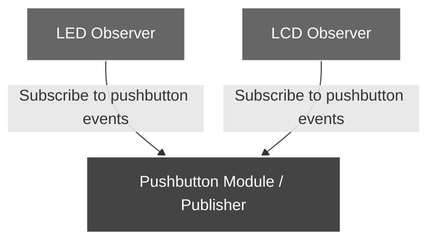
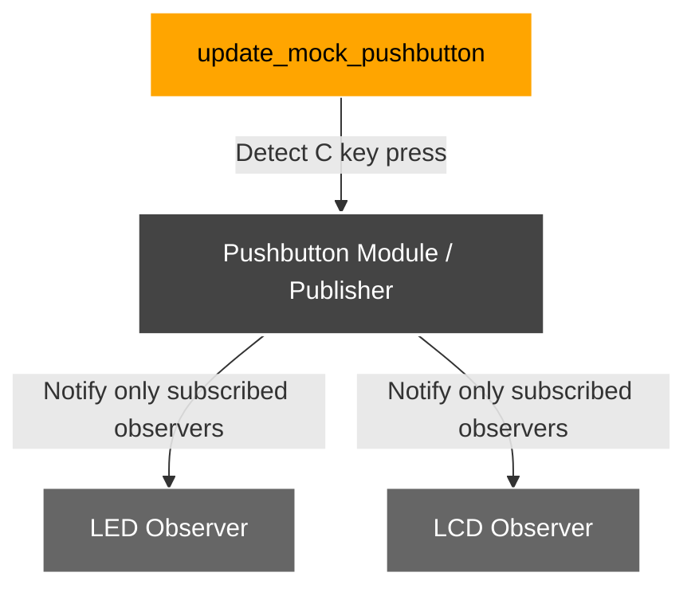
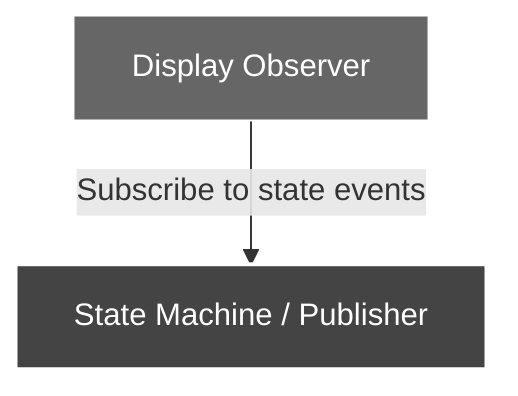
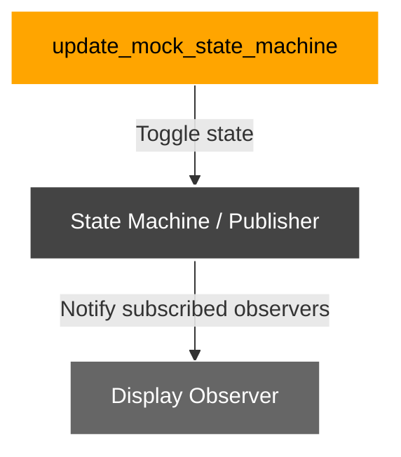
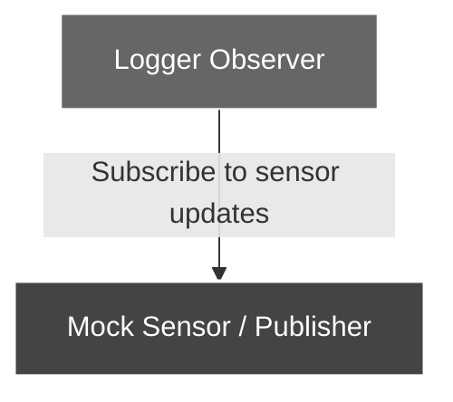
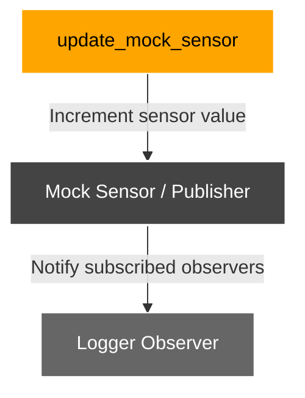

# Observer Library Examples Details

This document provides detailed information for each example in the Observer Library. Each folder contains all source (`.c`) and header (`.h`) files. The examples are designed with **safety-oriented practices**, **MISRA-C:2012 compliant**, and use **deterministic static memory**. Terminal I/O is only used for demonstration and is **not MISRA-compliant**.

---

## 📁 Directory Layout

```
examples/
├─ basic_observer/        # Basic Observer Example
├─ state_observer/        # Observer with State Machine Example
├─ observer_u8/           # Observer with uint8_t Notify Argument Example
└─ ...                    # Other future examples
```

---

## 1️⃣ Basic Observer Example

* **Folder:** `examples/basic_observer/`

* **Purpose:** Demonstrates multiple observers reacting to a pushbutton event in a deterministic, MISRA-C compliant way.

* **Files:**

  | File                  | Description                                                                           |
  | --------------------- | ------------------------------------------------------------------------------------- |
  | `main.c`              | Entry point. Initializes modules, sets up observer subscriptions, and runs main loop. |
  | `mock_LED.c/h`        | Mock LED observer that toggles its state on pushbutton events.                        |
  | `mock_LCD.c/h`        | Mock LCD observer that prints messages to terminal on pushbutton events.              |
  | `mock_pushbutton.c/h` | Simulates pushbutton input via terminal keyboard ('c' key) and notifies observers.    |

* **Detailed Description:**
  This example demonstrates a **basic observer pattern** in C. The system consists of a mock pushbutton event source and two observers: a mock LED and a mock LCD display. Each press of the 'c' key triggers a notification event:

1. The **pushbutton module** detects the key press and calls `notify()` only on **subscribed observers**.
2. The **LCD observer** prints a message indicating the key press.
3. The **LED observer** toggles its state and prints the new state.

**Static subscription tables** are used to avoid dynamic memory allocation. Observer callbacks are independent. Terminal I/O uses POSIX calls **for demonstration only**.

* **Build & Run:**

  ```bash
  cd examples/basic_observer
  cmake -S ./ -B out -G "Unix Makefiles"   # or "Ninja"
  cd out
  make all        # or ninja
  make run        # or ninja run
  ```

* **Expected Output:**

  ```
  [MOCK_LCD]: Key 'C' has been pressed
  [MOCK_LED]: LED IS ON
  [MOCK_LCD]: Key 'C' has been pressed
  [MOCK_LED]: LED IS OFF
  ```

* **Safety Notes:**

  * Deterministic execution using **static memory**.
  * Observer callbacks are independent.
  * Terminal I/O uses POSIX calls **for demonstration only**, not MISRA-compliant.

* **Relation Diagrams for Initialization and Main Loop Phases:**

<table>
<tr>
<td><center>

<b>Initialization Phase</b>



</center></td>
<td><center>

<b>Main Loop Phase</b>



</center></td> </tr> </table>

* **Explanation of Flow:**

  1. `main.c` initializes all modules (`init_mock_modules()`) and sets subscriptions (`set_all_subscriptions()`) in the **Initialization Phase**.
  2. Main loop (`for(;;)`) continuously calls `update_mock_pushbutton()` in the **Main Loop Phase**.
  3. When the user presses C key, pushbutton module invokes `notify()` **only for subscribed observers**.
  4. LED and LCD react independently.

---

## 2️⃣ State Observer Example

* **Folder:** `examples/state_observer/`

* **Purpose:** Demonstrates `observer_enter_exit` API with a mock state machine alternating between ENTER and EXIT states.

* **Files:**

  | File                     | Description                                        |
  | ------------------------ | -------------------------------------------------- |
  | `main_state_example.c`   | Entry point, initializes state machine and display |
  | `mock_state_machine.c/h` | Toggles state and notifies observers               |
  | `mock_display.c/h`       | Prints messages on state transitions               |

* **Detailed Description:**
  The mock state machine toggles between `ENTER` and `EXIT` states at a fixed interval (1 second). Observers subscribed to state events are notified on every state change. The display observer prints a message indicating the current state. Deterministic notifications and **static subscription tables** ensure safe execution.

* **Build & Run:**

  ```bash
  cd examples/state_observer
  cmake -S ./ -B out -G "Unix Makefiles"   # or "Ninja"
  cd out
  make all        # or ninja
  make run        # or ninja run
  ```

* **Expected Output:**

  ```
  [DISPLAY]: State ENTER
  [DISPLAY]: State EXIT
  [DISPLAY]: State ENTER
  ```

* **Safety Notes:**

  * Deterministic toggling between states.
  * Observers use **static subscription tables**.
  * Observer notifications are safe assuming **external synchronization**.

* **Relation Diagrams for Initialization and Main Loop Phases:**

<table>
<tr>
<td><center>

<b>Initialization Phase</b>



</center></td>
<td><center>

<b>Main Loop Phase</b>



</center></td> </tr> </table>

---

## 3️⃣ Observer with uint8_t Notify Argument Example

* **Folder:** `examples/observer_u8/`

* **Purpose:** Demonstrates `observer_u8` API with periodic mock sensor updates.

* **Files:**

  | File                    | Description                                             |
  | ----------------------- | ------------------------------------------------------- |
  | `main_sensor_example.c` | Entry point, initializes sensor and logger              |
  | `mock_sensor.c/h`       | Generates periodic sensor values and notifies observers |
  | `mock_logger.c/h`       | Logs sensor value to stdout                             |

* **Detailed Description:**
  The mock sensor generates incrementing `uint8_t` values at a fixed interval (0.5 seconds). Each new sensor value is sent to all subscribed observers using the `observer_u8` API. The logger observer prints the sensor value to the terminal. Deterministic updates, **static memory**, and safe observer execution are ensured **when subscription tables are properly sized**.

* **Build & Run:**

  ```bash
  cd examples/observer_u8
  cmake -S ./ -B out -G "Unix Makefiles"   # or "Ninja"
  cd out
  make all        # or ninja
  make run        # or ninja run
  ```

* **Expected Output:**

  ```
  [LOGGER]: Sensor value = 1
  [LOGGER]: Sensor value = 2
  [LOGGER]: Sensor value = 3
  ```

* **Safety Notes:**

  * Static memory only.
  * Deterministic updates.
  * Observer callbacks independent.

* **Relation Diagrams for Initialization and Main Loop Phases:**

<table>
<tr>
<td><center>

<b>Initialization Phase</b>



</center></td>
<td><center>

<b>Main Loop Phase</b>



</center></td> </tr> </table>
<br>

---

<p style="text-align: center;">
  
</p>

---